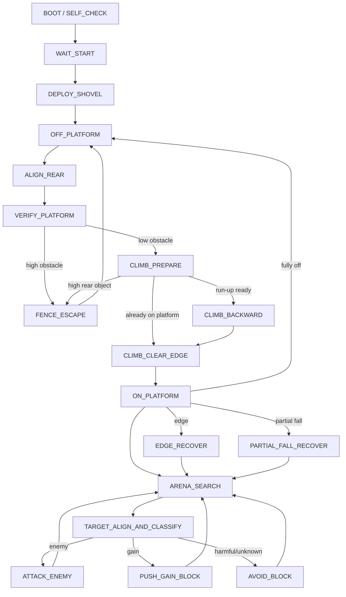

# WheelFight 2026 behavior design

Status: implemented baseline for bench testing and calibration. The controller
in `match_demo_state_machine.py` now follows this design; all numeric thresholds,
speeds, timings, and shovel positions remain provisional until physical tests.

## 1. Design assumptions

- The four drive motors are controlled as a left pair and a right pair for
  differential/skid steering.
- Two servos operate one front shovel. The shovel is raised before the match
  and lowered after the legal start event.
- The rear body ramp is the only intended climbing mechanism. The robot climbs
  by aligning its rear with the platform and accelerating backward.
- The Mega sensor bridge supplies one validated snapshot at 50 Hz.
- All motion sequences are non-blocking. Every control iteration must remain
  able to process edge, platform-transition, timeout, and communication-fault
  events.
- Numeric thresholds, speeds, servo positions, and action durations are
  calibration parameters, not constants embedded in behavior code.

## 2. Raw sensor map and semantic signals

| Raw channel | Physical meaning | Primary use |
| --- | --- | --- |
| A0-A11 | Twelve horizontal infrared ranging sensors, A0 forward, clockwise every 30 degrees | Object direction, enemy/block candidates, platform/fence candidates on the ground |
| A12 | Front underside grayscale | Front-on-platform estimate and front/rear transition recovery |
| A13 | Rear underside grayscale | Rear-on-platform estimate and rear transition recovery |
| DI0 | Front-left downward photoelectric | Raw 0 means nearby platform surface; raw 1 means likely left/front edge |
| DI1 | Front-right downward photoelectric | Raw 0 means nearby platform surface; raw 1 means likely right/front edge |
| DI2 | Rear high-object photoelectric | Raw 0 means a high rear object is present; raw 1 means no high rear object |
| Camera | Forward image | Energy-block classification and confidence |

The software should expose semantic values rather than use raw levels in state
handlers:

```text
front_left_edge       = DI0 == 1
front_right_edge      = DI1 == 1
rear_high_object      = DI2 == 0
front_on_platform     = calibrated interpretation of A12
rear_on_platform      = calibrated interpretation of A13
```

DI2 is not globally equivalent to `fence_detected`. It means a high object is
behind the robot. Only while the robot is below the platform, rear-aligned with
a ranging candidate, is that high object interpreted as the outer fence.

## 3. Perception layer

### 3.1 Snapshot health

Every behavior iteration consumes one complete `SensorFrame`. The perception
layer records its receive time and sequence number. A missing or stale safety
snapshot prevents new motion commands.

Initial timing policy, subject to real testing:

- Control iteration: 20 ms.
- Sensor stale warning: 60 ms.
- Safety stop: no valid sensor frame for 100 ms.
- Camera stale: 250 ms. Camera staleness disables block-pushing decisions but
  does not by itself stop the chassis.

### 3.2 Filtering

- Analog ranging and grayscale: short median/low-pass filter plus hysteresis.
- Front edge assertion: one high sample is enough to stop forward motion.
- Front edge clearing: require at least three consecutive low samples.
- Rear high-object confirmation: require at least three consistent samples
  before classifying a platform candidate as a fence.
- Platform state transitions: require stable evidence over multiple frames,
  except when an edge signal requires immediate action.

Filtering must preserve the raw values in logs.

### 3.3 Platform estimate

After grayscale calibration, derive one of:

The installed sensors currently read about 300 over the platform and about 900
off the platform. `gray_on_is_high` is therefore false: a filtered value at or
below `gray_on_enter` enters the on-platform state, while an active on-platform
state is retained until the value rises above `gray_off_exit`. Values between
the two thresholds preserve the previous semantic state.

| State | Front grayscale | Rear grayscale | Interpretation |
| --- | --- | --- | --- |
| `PLATFORM_ON` | on | on | Chassis is on the platform |
| `PLATFORM_OFF` | off | off | Chassis is on surrounding ground |
| `PLATFORM_FRONT_TRANSITION` | off | on | Front is leaving/hanging; reverse toward the platform |
| `PLATFORM_REAR_TRANSITION` | on | off | Rear is leaving/hanging; drive forward toward the platform |
| `PLATFORM_UNKNOWN` | inconsistent | inconsistent | Stop aggressive motion and gather more samples |

The platform has a black-to-white gradient and its black corners can resemble
the black ground. The final estimator must use hysteresis, recent motion/state,
front edge signals, and the front/rear change pattern rather than one global
grayscale threshold alone.

### 3.4 Infrared object clusters

Adjacent A0-A11 detections are grouped into an object cluster. A cluster
contains:

- relative bearing;
- nearest/representative range value;
- angular width;
- persistence time;
- last-seen time;
- temporary classification, if any.

A6 uses its own calibrated enter/exit thresholds because its farther-forward
mounting position produces a weaker rear-facing reading than A5/A7. The same
A6 exit threshold is also used as its cluster-strength baseline so that an
active A6 both connects and meaningfully centers the rear cluster.

The robot remains reactive and does not require an absolute map. Cluster
history is short-lived and is cleared after major climb/fall transitions.

### 3.5 Camera interface

The state machine consumes a backend-independent result:

```text
type: GAIN | HARMFUL | NO_BLOCK_MARKER | UNKNOWN | NONE
confidence: 0.0 .. 1.0
gain_color_ratio: yellow-green pixel share inside the ROI
harmful_color_ratio: red pixel share inside the ROI
red_x_score: normalized red-X geometry score
red_x_detected: whether the red-X score reaches its threshold
red_x_angle_deg: best angle in the normalized red-candidate grid
timestamp: monotonic time
```

The color detector converts a fixed central camera ROI to HSV and measures the
configured target colors. Its deliberately simple classification rules are:

- yellow-green reaches the configured area threshold -> `GAIN`;
- red reaches the area threshold and forms a clear cross at any searched angle
  -> `HARMFUL`;
- significant red without a confirmed cross -> `UNKNOWN`;
- neither marker color reaches its area threshold -> `NO_BLOCK_MARKER`;
- yellow-green and a valid red X are both present -> `UNKNOWN`.

Each connected red candidate is normalized to a small grid. Its X score
searches one 90-degree period for two perpendicular crossing lines, requires
red coverage in all four arms and the crossing center, then penalizes red
coverage outside the selected lines; the highest candidate score is used. A
red rectangular arena marking or a solid red patch therefore does not satisfy
the harmful-block rule, even if it appears beside a separate red X. Gain
recognition remains a color-only decision.
Consequently, yellow-green plus unrelated invalid red remains `GAIN`; only a
confirmed red cross conflicts with yellow-green and produces `UNKNOWN`.

A `NO_BLOCK_MARKER` frame is counted as enemy evidence only when its confidence
also reaches the configured minimum. Any frame with significant unconfirmed red
is `UNKNOWN`, so a rotated, distorted, or incomplete harmful marker cannot
become enemy evidence merely because its cross score missed the threshold.

The state machine requires consecutive, consistent fresh-frame votes before
acting on these per-frame results. An unknown or conflicting frame resets the
current classification streak.

`NO_BLOCK_MARKER` can be used as enemy evidence only when:

- the ranging target is centered so its artwork falls inside the fixed ROI;
- the target is close enough for the configured color-area threshold;
- the camera and ROI are valid;
- the required number of consecutive fresh frames vote `NO_BLOCK_MARKER`.

A camera failure or invalid frame is `UNKNOWN`, not `NO_BLOCK_MARKER`.

## 4. Behavior architecture



This is a hierarchical state machine. `OFF_PLATFORM` and `ON_PLATFORM` are
parent modes; their child states are described below. A separate safety
supervisor can preempt any ordinary child state.

## 5. Global arbitration priority

Highest priority wins on every 20 ms iteration:

1. Emergency stop, invalid/stale Mega data, match end.
2. Partial fall/platform transition recovery.
3. Front edge recovery while on the platform.
4. Rear-fence abort while probing or climbing below the platform.
5. Completion/timeout of the current non-blocking action step.
6. Current target attack, block push, or avoidance.
7. Search/patrol and anti-stall motion.

No target-related action may suppress edge or platform-transition processing.

## 6. System states

### `BOOT_SELF_CHECK`

Actions:

- command drive motors to zero;
- hold shovel in the raised/pre-match pose;
- wait for stable Mega frames;
- initialize camera and detector;
- verify that sensor values are within electrical ranges;
- clear target and action history.

Exit to `WAIT_START` when required safety inputs are healthy. Camera failure is
reported but may permit a reduced no-block-push mode.

### `WAIT_START`

The robot remains fully stationary and inside the start area. It waits for an
abstract legal `START_EVENT` supplied by the final start mechanism. It must not
use remote driving.

### `DEPLOY_SHOVEL`

After `START_EVENT`, lower both shovel servos using a timed, non-blocking action
with a final hold position. Platform searching may begin while the shovel is
settling only if the mechanism is mechanically safe to move simultaneously.

After deployment, classify the initial platform state. The normal initial
transition is to `OFF_PLATFORM.SEARCH_CANDIDATE`.

## 7. Off-platform and climbing behavior

### `SEARCH_CANDIDATE`

Purpose: find a ranging direction that may be either the low platform or the
high outer fence.

Actions:

- rotate at search speed, continuously updating A0-A11 clusters;
- prefer broad, persistent, nearer clusters;
- do not accelerate into any unverified cluster;
- maintain nonzero motion so search cannot become passive for 10 seconds.

Exit to `ALIGN_REAR` after selecting a stable candidate. If no candidate is
found after a full search timeout, perform a short safe translation and rescan.

### `ALIGN_REAR`

Purpose: place the selected candidate at the rear A6 direction.

Actions:

- rotate using cluster bearing feedback;
- reduce turn speed as the candidate approaches A6;
- require stability from the configured rear ranging sector (A5/A6/A7 by
  default) before stopping the turn.

Exit to `VERIFY_PLATFORM` when the rear ranging cluster is centered. If the
cluster disappears, wait for the configured `rear_candidate_lost_grace`
before returning to search so a brief ranging dropout does not restart the
whole search sequence.

### `VERIFY_PLATFORM`

Purpose: distinguish low platform from high fence.

Actions:

- approach backward only at low probe speed if the candidate is too far;
- continuously monitor rear ranging and DI2;
- stop immediately if DI2 confirms a high rear object;
- require several consistent frames before accepting a low obstacle.

Decision:

```text
rear ranging absent                 -> candidate lost, search again
rear ranging present and DI2 == 0  -> high object/fence, reject
rear ranging present and DI2 == 1  -> low object/platform candidate
```

Only the third combination may enter `CLIMB_PREPARE`.

### `CLIMB_PREPARE`

Purpose: create enough forward separation for the later backward acceleration
run without losing the verified platform candidate.

Actions:

- drive forward at `climb_prepare_speed` for
  `climb_prepare_forward_time`, moving away from the platform to create the
  run-up distance;
- do not treat the expected weakening or disappearance of the rear ranging
  cluster during this forward motion as a lost candidate;
- stop for `climb_prepare_settle_time` before reversing, reducing mechanical
  and current shock when the motor direction changes;
- continuously monitor DI2 and abort to `FENCE_ESCAPE` if a high rear object
  is confirmed;
- if both grayscale sensors already report on-platform, stop preparation and
  enter `CLIMB_CLEAR_EDGE` instead of driving forward off the platform;
- reset the recorded climb grayscale sequence immediately before entering
  `CLIMB_BACKWARD`.

All preparation phases are non-blocking, so communication faults and the rear
high-object protection remain able to preempt the motion every control cycle.

### `FENCE_ESCAPE`

Actions:

- stop reverse motion immediately;
- drive forward a short sensor-checked distance;
- turn clockwise/right for a calibrated duration after clearing the rear
  obstacle; repeated fence escapes use the same deterministic direction;
- clear that candidate and resume scanning.

The escape is non-blocking. Sensor-link faults and match-end supervision remain
active; separate grayscale-transition preemption for this ground escape is not
yet implemented and remains part of the deferred safety work.

### `CLIMB_BACKWARD`

Actions:

- ensure the rear candidate remains low, not high;
- accelerate backward using the rear ramp;
- track the expected grayscale progression: both off, rear on first, then both
  on;
- abort on high rear-object detection, excessive timeout, or impossible
  transition order.

Success requires both grayscale positions to report on-platform consistently.
Failure executes a controlled forward withdrawal before another alignment
attempt.

### `CLIMB_CLEAR_EDGE`

After both grayscale sensors report on-platform, continue backward at moderate
speed toward the platform interior. Do not immediately drive forward because
the front still faces the outer edge.

Success conditions:

- both grayscale positions remain on-platform;
- both front downward sensors report nearby platform surface (`DI0=0`,
  `DI1=0`);
- the condition remains stable for a configured clearance time.

Then stop, clear ground-search history, and enter `ON_PLATFORM.ARENA_SEARCH`.

## 8. On-platform behavior

### `ARENA_SEARCH`

When no target cluster is present, the robot actively patrols straight ahead
at a calibrated low speed rather than remaining stationary:

- command equal positive left/right speeds while continuously forming and
  tracking A0-A11 object clusters;
- stop in the same control iteration when a target cluster appears, then enter
  `TARGET_ALIGN` to face and classify it;
- immediately preempt on edge or platform-transition evidence;
- let `EDGE_RECOVER` withdraw from the edge and change the chassis heading
  before returning to straight-ahead patrol.

`ARENA_SEARCH` itself does not change the patrol heading. Its forward speed
must remain low enough for the edge supervisor and chassis braking distance.

When `TARGET_ALIGN` starts, it selects the cluster with the smallest angular
error from A0/the current chassis heading. If two clusters have the same
angular error, the stronger cluster wins. This minimizes unnecessary rotation
and prevents a strong rear cluster from taking priority over a target already
near the forward camera axis.

### `TARGET_ALIGN_AND_CLASSIFY`

Actions:

- repeatedly select the cluster nearest the current A0 direction and rotate
  until that cluster is centered;
- abandon the classification candidate if its bearing exceeds the configured
  `target_classify_loss_bearing_deg`; otherwise return to `TARGET_ALIGN` when
  it leaves the tighter centering tolerance;
- keep enough standoff distance for the artwork colors to remain inside the
  fixed central ROI;
- use A11/A0/A1 to refine alignment;
- collect multiple fresh camera results.

Decision:

- stable high-confidence `GAIN` -> `PUSH_GAIN_BLOCK`;
- any confident `HARMFUL` -> `AVOID_BLOCK`;
- good-view `NO_BLOCK_MARKER` over multiple frames -> `ATTACK_ENEMY`;
- `UNKNOWN`, stale, off-center, or inconsistent -> reposition and retry;
- target lost -> `ARENA_SEARCH`.

The robot must never interpret a single `NO_BLOCK_MARKER` result as an enemy.

### `ATTACK_ENEMY`

Actions:

- lower/hold the shovel in attack position;
- drive forward with steering correction from the target bearing;
- only accept a tracking cluster inside the configured
  `attack_target_max_bearing_deg` forward sector;
- reduce speed if target confidence/ranging quality falls;
- do not continue a blind charge after target loss beyond a short grace time;
- abort immediately if the target is newly classified as harmful.

Preemption:

- either front edge signal -> stop forward drive in the same control cycle and
  enter `EDGE_RECOVER`;
- front/rear grayscale transition -> `PARTIAL_FALL_RECOVER`;
- both grayscale off -> `OFF_PLATFORM`.

### `PUSH_GAIN_BLOCK`

This state is more conservative than enemy attack because a classification
error can award six points to the opponent.

Entry requires:

- several consistent gain classifications;
- confidence above the calibrated threshold;
- target centered and within the expected block size/range;
- healthy camera and sensor timestamps.

Actions:

- approach at controlled speed;
- keep the block centered using ranging/camera bearing;
- push toward an edge while continuously processing DI0/DI1;
- stop/reverse as soon as an edge is asserted;
- infer block departure from target loss plus edge context, then retreat.

Any harmful/unknown reclassification aborts the push. A block is never chased
with a stale camera result.

### `AVOID_BLOCK`

For harmful or unresolved energy blocks:

- stop approach;
- turn clockwise/right in place for a calibrated duration intended to produce
  approximately 180 degrees of heading change;
- drive forward at a separate low departure speed for a calibrated short
  duration, physically increasing separation from the rejected target;
- ignore ordinary target clusters until both phases finish, while still
  allowing sensor-link, match-end, platform-transition, fall and front-edge
  safety preemption every control cycle;
- stop at the end of departure and return to `ARENA_SEARCH`; another visible
  cluster is then aligned, otherwise straight-ahead patrol resumes.

The turn and departure durations are open-loop calibration values. The
departure distance must be long enough that a stationary rejected block no
longer dominates the next all-direction scan. Avoidance direction does not
alternate between attempts.

## 9. Edge and fall recovery

### `EDGE_RECOVER`

The edge assertion uses asymmetric filtering: trigger immediately, clear only
after several safe samples.

| Edge input | Initial response |
| --- | --- |
| DI0=1, DI1=0 | Stop, short reverse along the known arrival path, then turn right away from the left/front edge |
| DI0=0, DI1=1 | Stop, short reverse along the known arrival path, then turn left away from the right/front edge |
| DI0=1, DI1=1 | Stop, reverse straight along the known arrival path, then turn right |

The double-edge response always turns right; it does not alternate direction
between recoveries.

Reverse recovery is short because there is no dedicated rear downward digital
edge sensor. A13 must be monitored continuously; if the rear begins leaving the
platform, reverse is stopped and the transition recovery takes control.

Exit only when both front edge inputs have cleared, both grayscale sensors are
consistent with on-platform, and the robot has turned away from the edge.

### `PARTIAL_FALL_RECOVER`

This state attempts to prevent a partial departure from becoming a full fall:

- front off, rear on -> reverse toward the platform interior;
- front on, rear off -> drive forward toward the platform interior;
- inconsistent/unknown -> stop translation and use a conservative turn only
  if safe;
- both off -> stop the recovery attempt and enter off-platform search.

All actions use short steps and re-evaluate the front edge inputs and grayscale
state every 20 ms.

## 10. Safety and degraded modes

### `FAULT_STOP`

Enter for stale Mega frames, invalid safety data, or an explicit emergency stop.
Command all four drive motors to zero. Do not leave until fresh data is stable
and the recovery policy explicitly permits resuming.

### Camera degraded mode

If the camera or detector is unavailable:

- disable gain-block pursuit and block-pushing states;
- do not classify one missing-color result as an enemy;
- continue edge-safe moving search to avoid passive-play behavior;
- attack only if a later calibrated IR-only enemy-confidence rule is available;
  otherwise remain mobile and avoid unresolved close objects.

### Stuck watchdog

If motion is commanded but ranging/grayscale features remain essentially
unchanged for a calibrated interval:

- quantize all filtered analog readings with `stuck_analog_bin_size` so small
  ADC noise does not continually reset the watchdog;
- stop the current action;
- for a ground/climb action, enter the forward-then-right-turn
  `FENCE_ESCAPE` sequence;
- for an arena attack or push action, enter the right-turn-then-forward
  `AVOID_BLOCK` sequence;
- return to the relevant search state after that escape completes.

This watchdog is distinct from the 10-second passive-play rule; it should react
well before 10 seconds.

### `MATCH_END`

At the configured `match_duration` (120 seconds by default) from the legal
start event, command drive motors to zero and hold the shovel safely. This
terminal state ignores ordinary target events.

## 11. Main control-loop contract

```python
while match_active:
    frame = mega_reader.latest_frame()
    camera_result = camera_reader.latest_result()

    perception.update(frame, camera_result, now)
    safety_event = safety_supervisor.evaluate(perception, now)

    if safety_event:
        state_machine.preempt(safety_event)
    else:
        state_machine.step(perception, now)

    command = motion_arbiter.command_for(state_machine, perception, now)
    motor_controller.apply(command)
```

State handlers select desired motion; only one motion arbiter writes motor
commands. This prevents a recovery state and an attack state from issuing
conflicting commands in the same cycle.

## 12. Parameters to calibrate

Keep these in a configuration file:

- A0-A11 object/range thresholds and direction weighting;
- A12/A13 on/off thresholds, hysteresis, and gradient compensation;
- DI0/DI1 edge assertion/clear timing;
- DI2 fence confirmation timing and valid rear ranging window;
- `rear_platform_ir_indices`: rear ranging channels used by alignment and
  low-platform verification (A5/A6/A7 by default);
- `rear_candidate_lost_grace`: brief rear-cluster dropout allowance;
- `target_classify_loss_bearing_deg` and `attack_target_max_bearing_deg`:
  maximum target bearings for classification and attack tracking;
- `stuck_analog_bin_size`: analog feature quantization used by the stuck
  watchdog;
- `sensor_read_timeout` and `sensor_reconnect_interval`: Mega serial receive
  and reconnect timing;
- search, alignment, probe, climb, patrol, attack, push, and recovery speeds;
- `avoid_turn_speed` and `avoid_turn_time`: tune together for approximately
  180 degrees of clockwise/right rotation;
- `avoid_depart_speed` and `avoid_depart_time`: low-speed forward separation
  after the avoidance turn;
- `climb_prepare_speed`: forward speed used to create backward run-up room;
- `climb_prepare_forward_time`: duration of that forward separation motion;
- `climb_prepare_settle_time`: zero-speed dwell before changing to high-speed
  reverse;
- climb timeout and expected front/rear grayscale transition timing;
- post-climb clearance duration;
- servo raised/lowered angles, speed, and settling time;
- camera confidence, minimum target size, multi-frame vote count, and timeout;
- `target_center_confirm_time`: zero-speed centered dwell before camera
  classification starts;
- target-loss grace time, `match_duration`, and stuck-watchdog timeout.

## 13. Implementation order and acceptance gates

Implement and test in this order; do not enable the next behavior until the
previous gate passes:

1. Semantic sensor layer and replayable logs.
2. Motor stop/forward/reverse/turn primitives with non-blocking timing.
3. Front edge preemption on a stationary raised test platform.
4. Front/rear grayscale transition recovery at low speed.
5. Ground candidate scan and rear alignment.
6. Platform-versus-fence verification using rear ranging plus DI2.
7. Low-speed platform probe, forward run-up preparation, then full-speed climb
   and interior clearance.
8. On-platform moving search and target alignment.
9. Central-ROI HSV color detector with recorded-video replay.
10. Harmful/unknown avoidance.
11. Gain-block push with edge preemption.
12. Enemy attack with target-loss and edge/fall recovery.
13. Communication loss, camera failure, USB reconnect, and 30-minute endurance
    tests.

Every test log should contain raw sensors, filtered semantics, current state,
state-reason, action step, motor command, camera result, and all timeout/error
counters.

## 14. Remaining mechanical confirmations

Before motor-control implementation, confirm:

- exact mapping and sign of the four motors into left/right pairs;
- whether forward/reverse commands are symmetric under load;
- shovel servo IDs, raised/lowered angles, and whether both servos mirror;
- the physical order of the two grayscale sensors and the remaining margin of
  the calibrated low-on-platform polarity after final mounting;
- safe probe distance, climb distance, and rear optical detection envelope.
